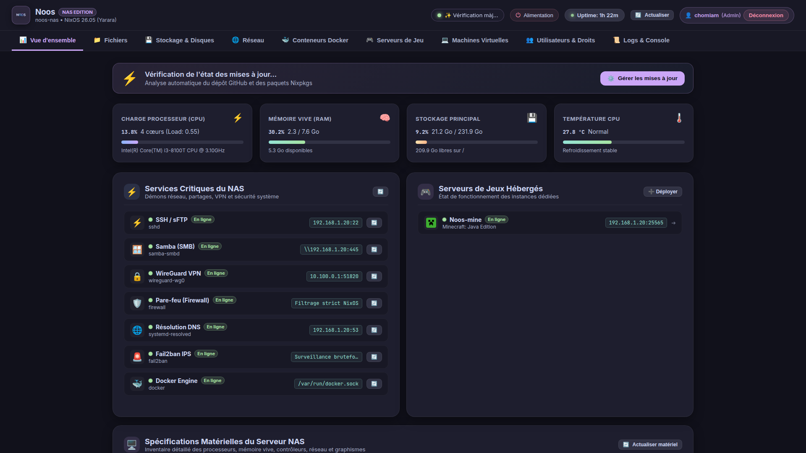
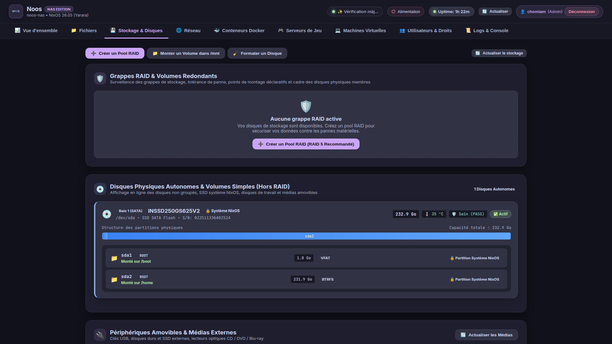
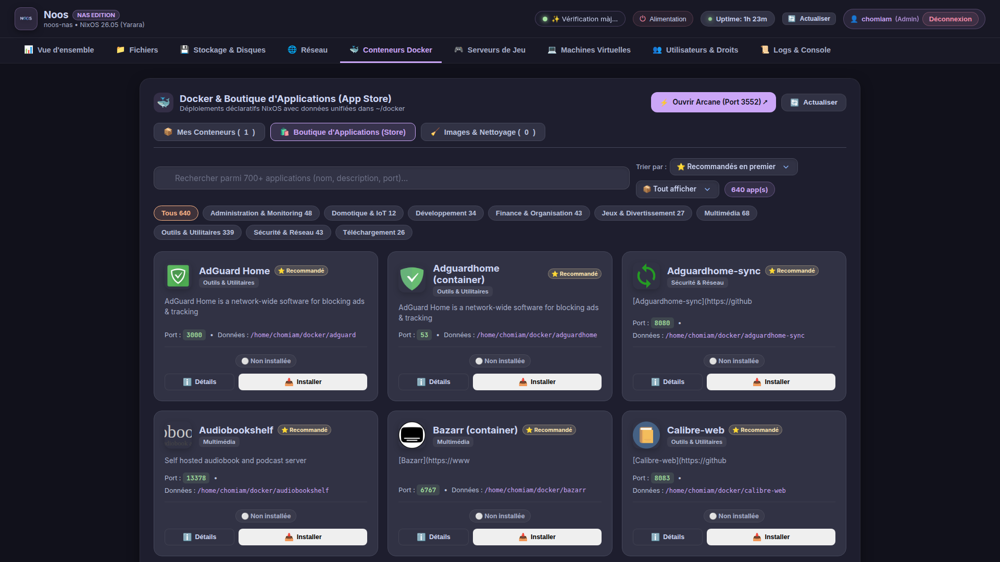
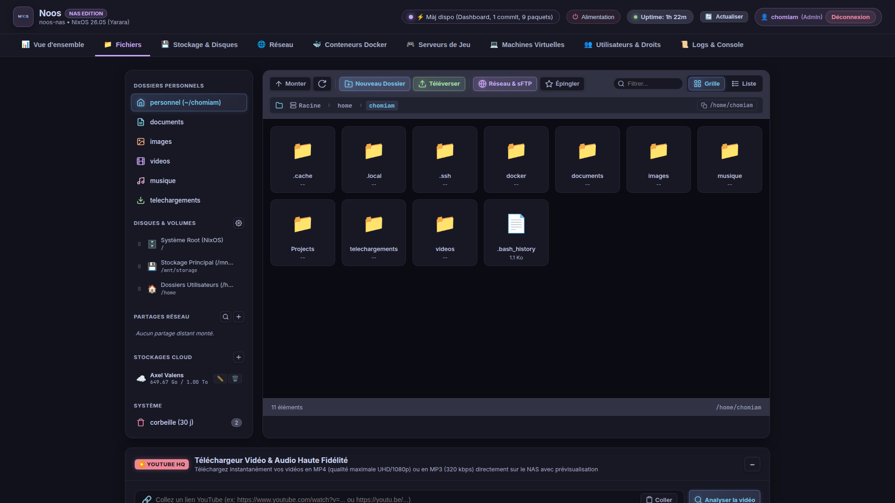
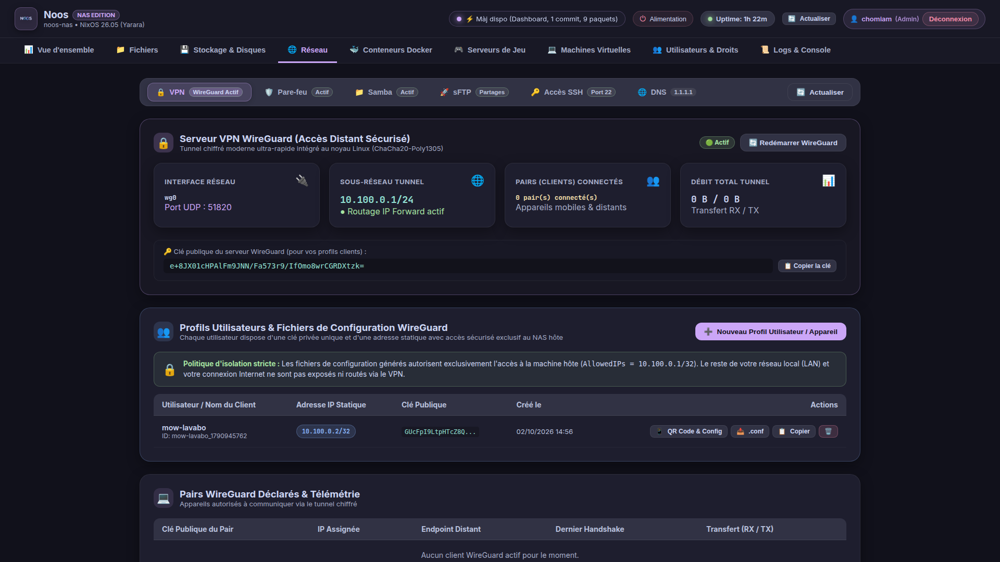
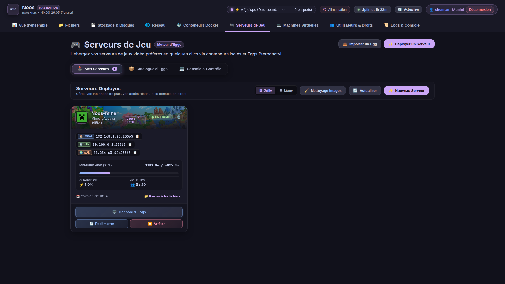

<div align="center">
  
  <br/><br/>

  # 🚀 Noos NAS Dashboard
  ### *Le Centre de Commandement Nouvelle Génération pour Serveurs de Stockage Souverains*

  [-orange?style=for-the-badge&logo=rust&logoColor=white)](https://www.rust-lang.org)
  [-yellow?style=for-the-badge&logo=javascript&logoColor=black)](https://developer.mozilla.org/fr/docs/Web/JavaScript)
  [](https://github.com/catppuccin/catppuccin)
  [-blue?style=for-the-badge)](#)
  [](#)
  [](LICENSE)

  <p align="center">
    <strong>Élégant, instantané et ultra-sécurisé. Pilotez l'intégralité de votre NAS depuis une interface moderne pensée pour simplifier votre vie numérique.</strong>
  </p>
</div>

---

## ✨ L'Expérience Noos : La Simplicité d'un NAS Grand Public, la Puissance du Bare-Metal

Fini les interfaces d'administration lourdes, lentes à charger ou visuellement dépassées. **Noos NAS Dashboard** combine la robustesse d'un moteur asynchrone compilé en **Rust** avec le design apaisant et soigné de la palette **Catppuccin Mocha**. 

Que vous souhaitiez surveiller la température de vos processeurs, créer une grappe RAID, déployer une application Docker en un clic ou gérer vos partages réseau depuis votre smartphone, tout s'exécute à la vitesse de l'éclair sans aucun temps de chargement superflu.

---

## 📸 Galerie & Visite Guidée de l'Interface

### 1. 📊 Vue d'Ensemble & Télémétrie en Direct
*Gardez un œil constant sur la santé de votre machine sans jamais ouvrir un terminal.*

<div align="center">
  
</div>

- **Jauges dynamiques** : Utilisation processeur temps réel (CPU), consommation de mémoire vive (RAM), espace disque disponible et température de fonctionnement.
- **État des services critiques** : Statut en ligne de SSH, Samba (SMB), WireGuard VPN, Pare-Feu, DNS et Docker Engine avec adresses IP et boutons de redémarrage direct.
- **Spécifications matérielles détaillées** : Détection automatique du modèle de carte mère, socket processeur, canaux de RAM et contrôleur graphique avec statut du transcodage matériel (Intel QuickSync / AMD VA-API).

---

### 2. 🗄️ Stockage Résilient, Grappes RAID & Santé des Disques
*Configurez, organisez et sécurisez vos données en toute sérénité.*

<div align="center">
  
</div>

- **Grappes RAID & Pools Redondants** : Assistant de création de pools de stockage (RAID 5 recommandé, RAID 1, RAID 0, JBOD) pour garantir une tolérance maximale aux pannes matérielles.
- **Disques physiques autonomes** : Liste complète des disques SATA et NVMe avec capacité totale, bus, numéro de série et température individuelle.
- **Diagnostic SMART prédictif** : Indicateur de santé matériel instantané (`Sain (PASS)`) pour anticiper les pannes avant qu'elles ne surviennent.
- **Économie d'énergie Spindown** : Mise en veille automatique des disques durs rotatifs lorsqu'ils ne sont pas sollicités.

---

### 3. 🛍️ Boutique d'Applications Officielle (App Store — Plus de 640 Apps)
*Transformez votre serveur en couteau suisse numérique en un clic.*

<div align="center">
  
</div>

- **Catalogue riche de 640+ applications auditées** : Immich, AdGuard Home, Audiobookshelf, Calibre-Web, Vaultwarden, Nextcloud, Uptime Kuma, Plex, Jellyfin et bien d'autres.
- **Filtres par catégories thématiques** : Multimédia, Domotique & IoT, Sécurité & Réseau, Téléchargement, Outils & Utilitaires, Finance.
- **Déploiement assisté intelligent** :
  - Détection automatique de la présence d'accélération matérielle GPU (`/dev/dri`).
  - Sélecteur officiel complet des fuseaux horaires IANA (`TZ`).
  - Génération automatique des clés secrètes d'environnement (`.env`).
  - Zéro conflit de port : les ports réseau sont testés et ouverts automatiquement dans le pare-feu.

---

### 4. 📁 Explorateur de Fichiers Web & Outils Intégrés
*Accédez à tous vos documents, photos et vidéos depuis n'importe quel navigateur.*

<div align="center">
  
</div>

- **Gestion fluide des dossiers et fichiers** : Arborescence rapide, vue en grille ou en liste, téléversement de fichiers volumineux par glisser-déposer.
- **Partages et montages unifiés** : Accès direct aux volumes système, dossiers personnels chiffrés, partages réseau distants et clouds externes (KDrive, Google Drive, Nextcloud).
- **Téléchargeur Vidéo & Audio Haute Fidélité (YouTube HQ)** : Enregistrez directement vos vidéos et podcasts en MP4 UHD ou MP3 320 kbps dans votre médiathèque privée en collant simplement l'URL.
- **Corbeille sécurisée avec rétention de 30 jours** pour prévenir toute suppression accidentelle.

---

### 5. 🛡️ Réseau, Pare-Feu Dynamique & Partages Réseau
*Une sécurité sans compromis, accessible à tous.*

<div align="center">
  
</div>

- **Contrôle visuel des ports** : Visualisez d'un coup d'œil tous les ports TCP et UDP autorisés par chaque service et conteneur actif.
- **Partages Samba (SMB/CIFS) & sFTP** : Créez des dossiers partagés pour Windows, macOS et Linux avec attribution fine des droits utilisateurs.
- **VPN WireGuard intégré** : Connectez vos ordinateurs et smartphones à distance avec génération de profils et QR codes en un clic.
- **Système de Prévention d'Intrusion Fail2ban** : Surveillance continue des tentatives de connexion suspectes avec bannissement automatique des adresses IP malveillantes.

---

### 6. 🎮 Serveurs de Jeux Vidéo Dédiés & Hub Pterodactyl
*Hébergez vos propres parties multijoueurs sans aucun frais d'abonnement.*

<div align="center">
  
</div>

- **Déploiement en 1 clic** : Minecraft Java & Bedrock, Palworld, Valheim, Counter-Strike 2, Rust, Terraria, Enshrouded, Project Zomboid.
- **Informations de connexion immédiates** : Affichage clair des adresses IP locales, VPN et WAN avec le port de jeu associé.
- **Console d'administration interactive** pour envoyer vos commandes de jeu en direct.

---

## ⚡ Sous le Capot : L'Excellence Technique

| Composant | Technologie Choisie | Bénéfice pour l'Utilisateur |
| :--- | :--- | :--- |
| **Serveur Backend** | **Rust (Axum 0.7 + Tokio)** | Démarrage en 10 ms, consommation mémoire minime (< 25 Mo), zéro crash mémoire. |
| **Interface Frontend** | **Vanilla ES6+ CSS3 Moderne** | Zéro framework encombrant (pas de React/Angular lourd), chargement instantané même sur connexion mobile. |
| **Thème Visuel** | **Catppuccin Mocha** | Contrastes optimisés, réduction de la fatigue oculaire, design moderne et épuré. |
| **Port Dédié** | **9339 (TCP)** | Aucun conflit avec les ports traditionnels du web (80, 443, 8080, 9090, 8096). |
| **Sécurité d'Accès** | **PAM Linux & Tokens chiffrés** | Respect strict des permissions système Unix, persistance sécurisée des sessions sur disque. |

---

## 🚀 Démarrage Rapide

### Exécution Locale (Développement)

```bash
# Compiler et lancer en mode développement (Rust 1.80+) :
cargo run

# Ou via l'environnement déclaratif Nix :
nix run
```

L'interface est immédiatement accessible sur :  
👉 **http://localhost:9339**

---

## 📄 Licence

Ce projet est distribué sous licence libre et copyleft **GNU General Public License v3.0 (GPLv3)**.  
Consultez le fichier [LICENSE](LICENSE) pour plus d'informations.

---

<div align="center">
  <sub>Fait partie de l'écosystème officiel <a href="https://github.com/Chomiam/noos-nas">Noos NAS Edition</a>.</sub>
</div>
